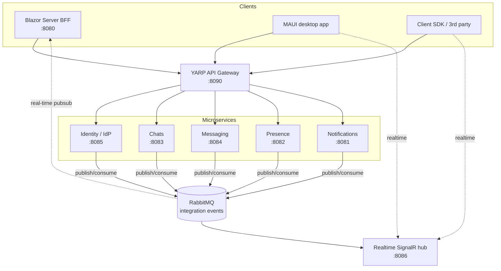

# TelegramLike

[](https://github.com/RostyslavArtiukh/telegram-like/actions/workflows/ci.yml)
[](https://dotnet.microsoft.com/)

A Telegram-like messenger built as a learning project to practise **microservices**,
**Domain-Driven Design**, **CQRS**, and **event-driven** architecture end to end — from
the domain model all the way to a real-time Blazor UI, a desktop app, and a Kubernetes
deployment.

It started as a modular monolith and was **incrementally migrated to microservices** behind a
Blazor Server BFF. The whole stack runs with a single `docker compose up`.

> ⚠️ **Learning/pet project.** The shared JWT signing secret is a committed dev default
> (fine for local dev, must be replaced for any real deployment — see [Security](#security)).

---

## Architecture

Five autonomous services (each *Domain / Application / Infrastructure / Api*, own MongoDB
database), a YARP API gateway, a Blazor Server BFF, a SignalR realtime hub for external
clients, a typed client SDK, and a MAUI desktop app — all glued together by RabbitMQ
integration events.



**Key rules of the design**

- **Never read another service's database.** Cross-context data is either embedded in
  integration events or projected into a local read-model (e.g. Presence's `chat_memberships`).
- **Transactional outbox** — services publish events atomically with their state changes
  (RabbitMQ + MassTransit), so at-least-once delivery is handled idempotently by consumers.
- **The gateway does no auth** — it forwards `Authorization` untouched; every service validates
  the JWT itself. It exists mainly because Chats and Messaging both serve `/chats/*`.
- **The Web BFF holds no domain and no database** — it keeps a cookie session, exchanges it for
  a short-lived access JWT at Identity, and talks to services only through the gateway.

## Services

| Service | Port | Responsibility | Storage |
|---|---|---|---|
| **Identity** (IdP) | 8085 | Users, auth, **signs the access JWTs** every service trusts | MongoDB + Redis (sessions) |
| **Chats** | 8083 | Chats, members, roles (direct / group / broadcast) | MongoDB |
| **Messaging** | 8084 | Messages, reactions, read receipts | MongoDB |
| **Presence** | 8082 | Online status + typing indicators | MongoDB + Redis |
| **Notifications** | 8081 | Fan-out notifications + unread counts | MongoDB |
| **Realtime** | 8086 | SignalR hub relaying events to external clients (SDK/MAUI) | — |
| **Gateway** | 8090 | YARP reverse proxy in front of the 6 backends (5 services + realtime) | — |
| **Web (BFF)** | 8080 | Blazor Server UI; pure BFF, no domain/DB | — |

> Ports above are the apps' own (local `dotnet run` / in-container) ports. **Docker compose
> publishes them on the host as `port + 10000`** — web `18080`, services `18081–18086`,
> gateway `18090` — so the compose stack never clashes with locally run apps.

## Tech stack

- **.NET 9**, C#
- **Blazor Server** (BFF UI) + **MudBlazor**; **.NET MAUI** Blazor Hybrid (desktop)
- **MongoDB** (per-service DB, replica set), **Redis** (sessions / presence)
- **RabbitMQ** + **MassTransit** (integration events, transactional outbox)
- **MediatR** (in-process CQRS), **FluentValidation**
- **YARP** (API gateway), **SignalR** (external realtime)
- **JWT** (HMAC-SHA256) service-to-service auth
- **OpenTelemetry → Jaeger** (tracing), **Prometheus + Grafana** (metrics), **Alertmanager**
- **xUnit + FluentAssertions + NSubstitute + Testcontainers** (tests)
- **Docker Compose** and **Kubernetes** (kustomize) deployments; **GitHub Actions** CI

## Repository layout

```
src/
  TelegramLike.Web/        Blazor Server BFF (UI)
  TelegramLike.Contracts/  Integration-event contracts (shared, pure)
  gateway/                 YARP API gateway
  services/                identity · chats · messaging · presence · notifications · realtime
  client/                  NuGet-packable typed client SDK (+ SignalR realtime client)
  app/                     MAUI Blazor Hybrid desktop app
  shared/                  Api.ServiceDefaults (shared JWT auth + controller base)
tests/                     unit + application + infrastructure (Testcontainers) tests
k8s/                       Kubernetes manifests (kustomize)
monitoring/                Prometheus rules, Grafana dashboards
```

## Running locally

**Prerequisites:** Docker (with Docker running — required for the whole stack and for
Testcontainers-based tests).

```bash
docker compose up -d --build
```

Then open **http://localhost:18080**, register two users in two browsers, create a chat, and
watch messages/typing/presence update in real time.

### Handy endpoints

| What | URL |
|---|---|
| Web app | http://localhost:18080 |
| Jaeger (traces) | http://localhost:16686 |
| RabbitMQ management | http://localhost:15672 |
| Grafana | http://localhost:3000 (anon view; `admin` / `admin`) |
| Prometheus | http://localhost:9090 |
| Alertmanager | http://localhost:9093 |

### Kubernetes

A kustomize deployment mirrors the compose stack:

```bash
docker compose build          # build the images
kubectl apply -k .            # namespace: telegramlike
# web available at http://localhost:30080 (NodePort)
```

## Building & testing

```bash
dotnet build TelegramLike.sln
dotnet test                   # Infrastructure tests use Testcontainers — Docker must be running
```

The MAUI app is **not** part of `TelegramLike.sln` (CI runs on Linux); build it via
`TelegramLike.App.slnx`.

## Clients

- **Client SDK** (`src/client`) — NuGet-packable typed clients for all five services (via the
  gateway) plus the auth flow and a SignalR realtime client. Consumed by both the Web BFF and
  the MAUI app.
- **MAUI desktop app** (`src/app`) — Blazor Hybrid, built purely on the SDK (Windows today,
  Android next).

## Security

The `ServiceAuth:JwtSecret` is a **committed dev default**, identical across every
`appsettings.json`, `docker-compose.yml`, and the k8s secret. Because the scheme is symmetric
HMAC, that value *is* the validation key — anyone with the repo could forge a token for any
user. This is fine for local development and is a **known, accepted risk for this practice
repo**; a real deployment must inject a freshly generated secret via env/secret store (never
committed) and rotate it.

---

*Built as a hands-on exploration of microservices patterns in .NET. Not affiliated with Telegram.*
