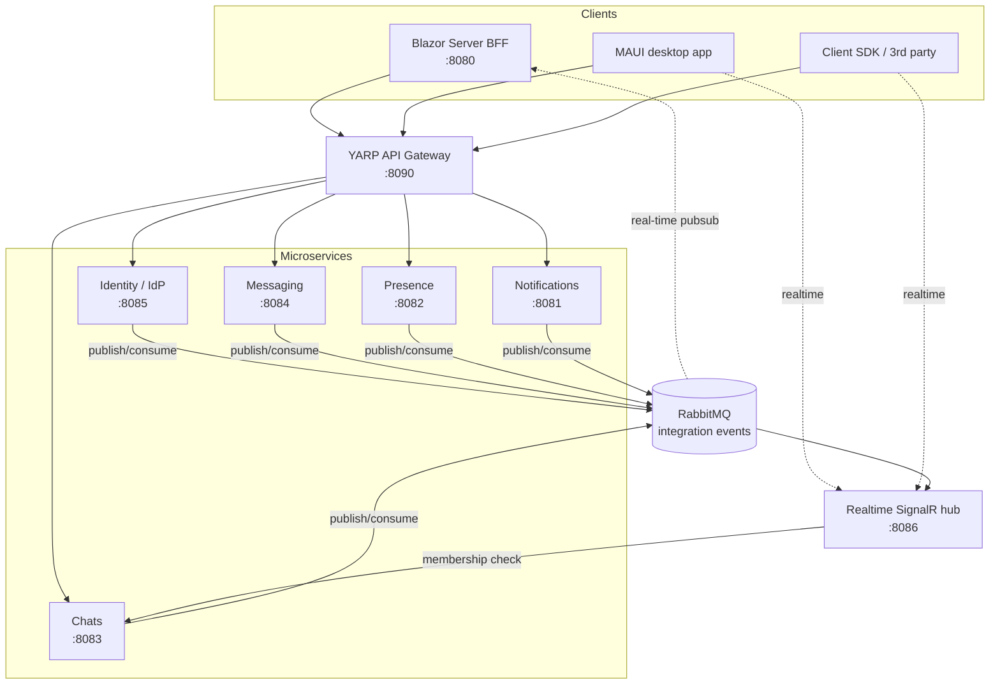

# TelegramLike

[](https://github.com/RostyslavArtiukh/telegram-like/actions/workflows/ci.yml)
[](https://dotnet.microsoft.com/)

A Telegram-like messenger built as a learning project to practise **microservices**,
**Domain-Driven Design**, **CQRS**, and **event-driven** architecture end to end — from
the domain model all the way to a real-time Blazor UI and a desktop app.

It started as a modular monolith and was **incrementally migrated to microservices** behind a
Blazor Server BFF. The whole stack runs with a single `docker compose up`.

> ⚠️ **Learning/pet project.** The shared JWT signing secret is a committed dev default
> (fine for local dev, must be replaced for any real deployment — see [Security](#security)).

---

## Architecture

Five autonomous services (each *Domain / Application / Infrastructure / Api*, own MongoDB
database), a YARP API gateway, a Blazor Server BFF, a SignalR realtime hub for external
clients, a typed client SDK, and a MAUI desktop app — all glued together by RabbitMQ
integration events.



**Key rules of the design**

- **Never read another service's database.** Cross-context data is either embedded in
  integration events or projected into a local read-model (e.g. Presence's `chat_memberships`).
  The one deliberate exception is the realtime hub: it authorises `JoinChat` by asking Chats
  over HTTP *as the connecting user* and caching the answer, rather than replicating an entire
  membership model to answer one boolean.
- **Transactional outbox** — services publish events atomically with their state changes
  (RabbitMQ + MassTransit), so at-least-once delivery is handled idempotently by consumers.
  Draining is not paced by the poll interval: the sender keeps going while there is work and
  only falls back to polling when the queue is empty.
- **Fan-out events carry a slice, not the room.** Events that embed their audience
  (`MessageSent`, `MemberJoined`, …) are split into parts of ≤500 recipients — otherwise a
  single event grows without bound with the size of the chat.
- **The gateway does no auth** — it forwards `Authorization` untouched; every service validates
  the JWT itself. It exists mainly because Chats and Messaging both serve `/chats/*`. It is,
  however, the only place that sees every request, so it **rate-limits per caller**: a token
  bucket keyed on the bearer token's `sub` — read, not verified, because this is a bucket key
  and never an authorization decision — falling back to the source address for sign-in traffic.
- **Indexes are declared, not hand-rolled.** A service registers an `IMongoIndexes`
  implementation and a shared initializer applies it at startup. The tests assert the query
  *plan* (`explain`, failing on `COLLSCAN`) rather than the result, because on a small dataset a
  missing index still returns the right answer and a result-based test stays green.
- **The Web BFF holds no domain and no database** — it keeps a cookie session, exchanges it for
  a short-lived access JWT at Identity, and talks to services only through the gateway.

## Services

| Service | Port | Responsibility | Storage |
|---|---|---|---|
| **Identity** (IdP) | 8085 | Users, auth, **signs the access JWTs** every service trusts | MongoDB + Redis (sessions) |
| **Chats** | 8083 | Chats, members, roles (direct / group / broadcast) | MongoDB |
| **Messaging** | 8084 | Messages, reactions, read receipts | MongoDB |
| **Presence** | 8082 | Online status + typing indicators | MongoDB + Redis |
| **Notifications** | 8081 | Fan-out notifications + unread counts | MongoDB |
| **Realtime** | 8086 | SignalR hub relaying events to external clients (SDK/MAUI) | — (in-memory membership cache) |
| **Gateway** | 8090 | YARP reverse proxy in front of the 6 backends (5 services + realtime); per-caller rate limiting | — |
| **Web (BFF)** | 8080 | Blazor Server UI; pure BFF, no domain/DB | — |

> Ports above are the apps' own (local `dotnet run` / in-container) ports. **Docker compose
> publishes them on the host as `port + 10000`** — web `18080`, services `18081–18086`,
> gateway `18090` — so the compose stack never clashes with locally run apps.

## Tech stack

- **.NET 9**, C#
- **Blazor Server** (BFF UI) + **MudBlazor**; **.NET MAUI** Blazor Hybrid (desktop)
- **MongoDB** (per-service DB, replica set), **Redis** (sessions / presence)
- **RabbitMQ** + **MassTransit** (integration events, transactional outbox)
- **MediatR** (in-process CQRS), **FluentValidation**
- **YARP** (API gateway), **SignalR** (external realtime)
- **JWT** (HMAC-SHA256) service-to-service auth
- **OpenTelemetry → Jaeger** (tracing), **Prometheus + Grafana** (metrics), **Alertmanager**
- **xUnit + FluentAssertions + NSubstitute + Testcontainers** (tests)
- **Docker Compose** deployment; **GitHub Actions** CI

## Repository layout

```
src/
  TelegramLike.Web/        Blazor Server BFF (UI)
  TelegramLike.Contracts/  Integration-event contracts (shared, pure)
  gateway/                 YARP API gateway
  services/                identity · chats · messaging · presence · notifications · realtime
  client/                  NuGet-packable typed client SDK (+ SignalR realtime client)
  app/                     MAUI Blazor Hybrid desktop app
  shared/                  Shared.{Domain,Application,Infrastructure,Api} (per-layer building blocks)
tests/                     unit + application + infrastructure (Testcontainers) tests
tools/                     TelegramLike.Simulator — N SDK bots generating live traffic
monitoring/                Prometheus rules, Grafana dashboards
build/                     pack-shared.ps1 — publishes the shared layer to the local feed
```

## Running locally

**Prerequisites:** Docker (with Docker running — required for the whole stack and for
Testcontainers-based tests).

```bash
docker compose up -d --build
```

Then open **http://localhost:18080**, register two users in two browsers, create a chat, and
watch messages/typing/presence update in real time.

### Handy endpoints

| What | URL |
|---|---|
| Web app | http://localhost:18080 |
| Jaeger (traces) | http://localhost:16686 |
| RabbitMQ management | http://localhost:15672 |
| Grafana | http://localhost:3000 (anon view; `admin` / `admin`) |
| Prometheus | http://localhost:9090 |
| Alertmanager | http://localhost:9093 |

### Making the dashboards show something

Those dashboards are empty until someone uses the system, so the repo ships a traffic
simulator: N bots (10 by default) built on the same client SDK as the MAUI app — real logins,
real HTTP through the gateway, real SignalR connections, presence heartbeats — chatting with
each other for an hour.

```bash
dotnet run --project tools/TelegramLike.Simulator   # Ctrl+C to stop; bots go offline cleanly
```

Each bot loops "random pause → weighted random action": send/reply with a typing indicator,
react, mark read, page through history, retract. That exercises the outbox, notification
fan-out, optimistic concurrency on reactions and the realtime push path all at once — so
Grafana, the RabbitMQ queues and Jaeger have real traffic to show. Intensity and duration are
configurable; see [its README](tools/TelegramLike.Simulator/README.md).

## Building & testing

```bash
./build/pack-shared.ps1       # publish the shared layer to the local NuGet feed — do this first
dotnet build TelegramLike.sln
dotnet test                   # Infrastructure tests use Testcontainers — Docker must be running
```

The shared layer (`TelegramLike.Contracts` + `src/shared/*`) ships as **versioned NuGet
packages** rather than project references, so services depend on a version instead of on
whatever is currently on disk. It has its own solution, `TelegramLike.Shared.slnx`, and its own
local feed at `artifacts/packages`; nothing else can restore until it has been packed once, and
`docker compose build` needs it too. Changing shared code means bumping that package's version.

The MAUI app is **not** part of `TelegramLike.sln` (CI runs on Linux); build it via
`TelegramLike.App.slnx`.

## Clients

- **Client SDK** (`src/client`) — NuGet-packable typed clients for all five services (via the
  gateway) plus the auth flow and a SignalR realtime client. Consumed by both the Web BFF and
  the MAUI app.
- **MAUI app** (`src/app`) — Blazor Hybrid, built purely on the SDK. Runs on **Windows**
  (unpackaged desktop) and **Android**, verified end to end on an emulator — where the app
  reaches the host's gateway through `10.0.2.2`, the emulator's alias for host loopback. iOS is
  out of reach from a Windows machine — even Apple's iOS Simulator requires macOS and Xcode.
- **Traffic simulator** (`tools/TelegramLike.Simulator`) — a third SDK consumer, used to put the
  running stack under realistic load; see [above](#making-the-dashboards-show-something).

## Review rounds

Twice the whole codebase was put through a deliberate review round, each finding landing as its
own commit so the reasoning stays attached to the change:

- **Maintainability** — wire-level event names decoupled from CLR type names; recipient
  derivation pulled back into the service that owns it instead of each UI host carrying a copy;
  Mongo indexes made declarative; and the shared layer turned into versioned NuGet packages, so
  a one-line change in shared code no longer silently rebuilds and redeploys all six apps.
- **Scalability** — query plans and the indexes behind them; fan-out events split into parts;
  an outbox that drains as fast as there is work rather than once per poll interval; a pubsub
  subscription leak in the BFF; and per-caller rate limiting at the gateway.

Both rounds are recorded with what was **given up** in exchange, not only what was fixed — e.g.
publishing the outbox concurrently trades away ordering within a batch, which nothing relies on
and which more than one replica had already given up.

## Security

The `ServiceAuth:JwtSecret` is a **committed dev default**, identical across every
`appsettings.json` and `docker-compose.yml`. Because the scheme is symmetric
HMAC, that value *is* the validation key — anyone with the repo could forge a token for any
user. This is fine for local development and is a **known, accepted risk for this practice
repo**; a real deployment must inject a freshly generated secret via env/secret store (never
committed) and rotate it.

---

*Built as a hands-on exploration of microservices patterns in .NET. Not affiliated with Telegram.*
